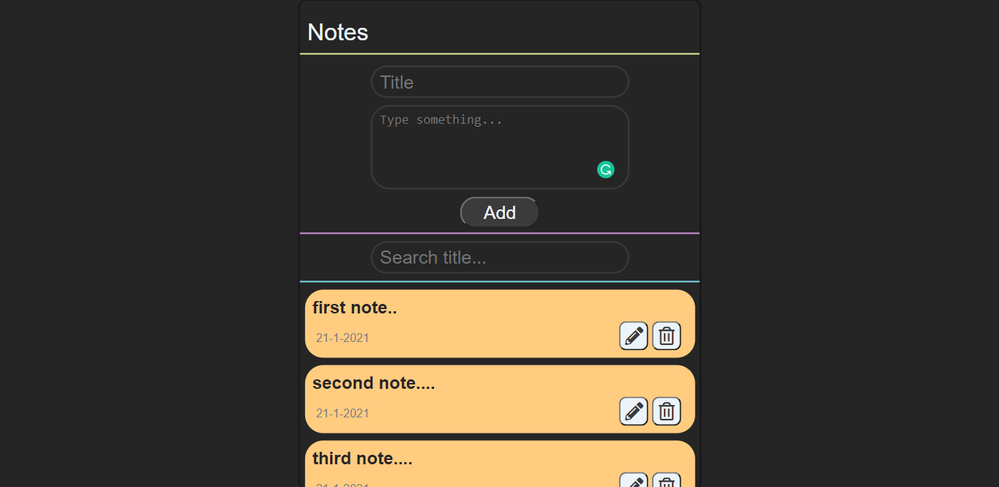
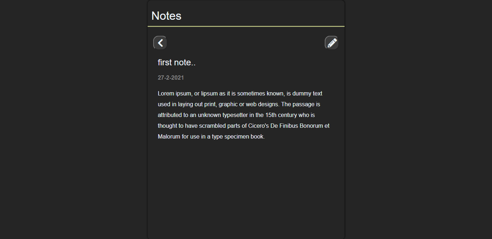

## [`Notes React Demo`](https://devilzer.github.io/notes-app/)

## Features

* Add new Note.
* Notes edit.
* Alert notifications.
* Persistant redux state.
* Search based notes filter.

## How to install and run?

1. Clone the repositories.
2. Install all dependencies by `npm install`
3. `npm start`

## App Overview.

#### Home page.
Home page with Input form,Search bar and List of notes.
 

#### Notes Details page.
 

## Directory Structure
`components` Contains all the React components. 
`redux` Contains Redux State mangement files (acitons,reducers). 
`style` Contains SCSS file for App styling. 
`config` Contains noty config files for notifications.
